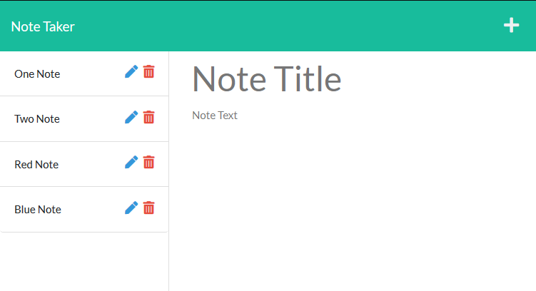

Just a simple note taking application.

# Project Description

There's not much to say about this project. It is your run of the mill note taking app. Within the app you will be able to create notes with a title and any amount of body text which can be saved. Once saved notes can then be edited or deleted.

# Setup/Installation

## Local

Once all project files have been downloaded the dependencies will need to be installed via your terminal of choice by running 'npm install' (the app uses Express.js). After this is set up, in your terminal run 'npm start' to spin up the Express instance.

Navigate to 'localhost:3000' in your browser to view the splash page. Clicking 'Get Started' will take you to the notes page.

## Heroku

The application is also ready for deployment to Heroku!

# Usage Instructions

From the notes page you will see two texts field, one for the title and one for the body of a note. Typing something in these fields (both fields must be populated) will pop up a save icon in the top right. Clicking this will save the note locally as well as populate the note title in a card on the left side of the screen.

Each saved note will have an edit and a delete icon. Clicking edit will take the title and body text of the note and populate the title and body fields to the right allowing to edit that note. Saving the note again will save the edits to the same note instead of creating a new note. Clicking the delete icon on a saved note will permanently delete the note. Clicking anywhere on a saved note's card (aside from the edit or delete icons) will populate that notes title and body text to the right but in read only mode. From this state if you need to start creating a new note, click the plus icon in the top right.
   

